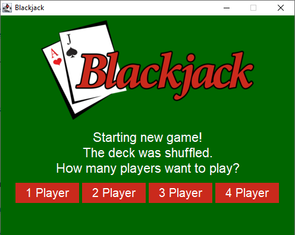

[](https://travis-ci.org/WollmannDaniel/BlackJack)

[](https://coveralls.io/github/WollmannDaniel/BlackJack?branch=master)

# BlackJack
Repository for Software Engineering from Daniel Wollmann and Vlad Bratulescu

# EN
### Rules
The goal is to get to 21 with the card values. The card values are added up and the player who gets closest to 21 wins. The face cards count 10 points and the aces have a special role, they can have the value of 1 or 11.

Each player is dealt two cards face up. The dealer is also dealt two cards, but only one card is shown.

Players take their turn one by one and can either "hit" to draw a card or "stand" to end their turn.

Players may draw cards for as long as they wish. If a player has a card value higher than 21, he loses the game and his turn ends automatically and it is the next player's turn.

After all players have finished their turn, the dealer automatically draws cards until he has a hand value greater than 16.

After the dealer has drawn his cards, all cards are revealed and the winners are shown.

# DE
### Spielregeln
Das Ziel ist es mit den Kartenwerten auf 21 zu kommen. Die Kartenwerte werden zusammengezählt und der Spieler wo am nähesten an 21 ist hat gewonnen. Die Bildkarten zählen 10 Punkte und die Asse haben eine Sonderrolle, diese können 1 oder 11 zählen.

Jeder Spieler erhält zu beginn zwei offene Karten. Der Dealer bekommt ebenfalls zwei Karten, wobei von ihm aber nur eine Karte gezeigt wird.

Die Spieler kommen nacheinander dran und können entweder mit "hit" eine Karte ziehen oder mit "stand" ihre Runde beenden.

Die Spieler dürfen so lange Karten nachziehen wie sie wollen. Hat ein Spieler einen höheren Kartenwert als 21 ist für ihn das Spiel verloren und seine Runde wird automatisch beendet und der nächste Spieler ist am Zuge.

Nachdem alle Spieler ihre Runde beendet haben, zieht der Dealer automatisch Karten nach bis er einen Handkartenwert größer als 16 hat.

Nachdem der Dealer seine Karten gezogen hat werden alle Karten aufgedeckt und die Gewinner angezeigt.

# Gameboard

## Welcome Screen


## Game Screen


## End Screen


# Steps to build our project on docker (MacOS)

1. Install xquartz (https://www.xquartz.org/)
1. Make sure xquartz is running in background
1. In the XQuartz preferences, go to the “Security” tab and make sure you’ve got “Allow connections from network clients” ticked

1. Allow connections from your local machine by running these commands in bash:
    1. ```ip=$(ifconfig en0 | grep inet | awk '$1=="inet" {print $2}')```
    1. ```xhost + $ip```
1. Build docker image
    1. ```docker build -t blackjack .```
1. Run docker
    1. ```docker run -e DISPLAY=$ip:0 -v /tmp/.X11-unix:/tmp/.X11-unix -ti blackjack```
1. Have fun!